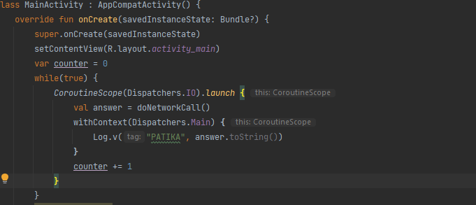

# Week-6 Homework

## 1- Write a counter in the loop that covers Coroutine Scope.



## 2- Does this action effects the infinite loop of the main thread?

Yes it is! Coroutine Scope does not return. If we break or return from the while loop we can see that
our Coroutine thread gives output.

## 3- Is this code works even once before it became infinite loop?

```
suspend fun doNetworkCall(): String {
        delay(2000L)
        return "NetworkCallAnswer"
```
No it isn't! Dispatchers.IO returns nothing until while loop end! When it is infinite it returns nothing.